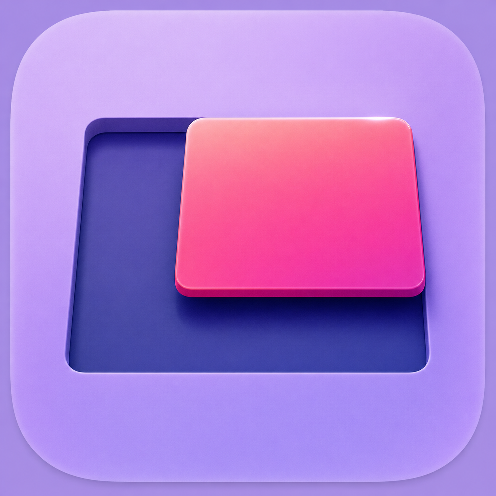
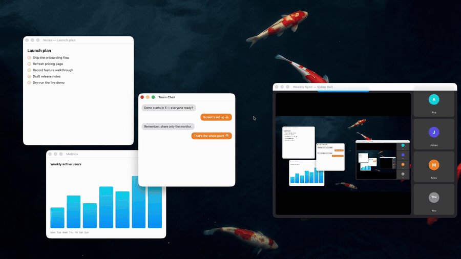
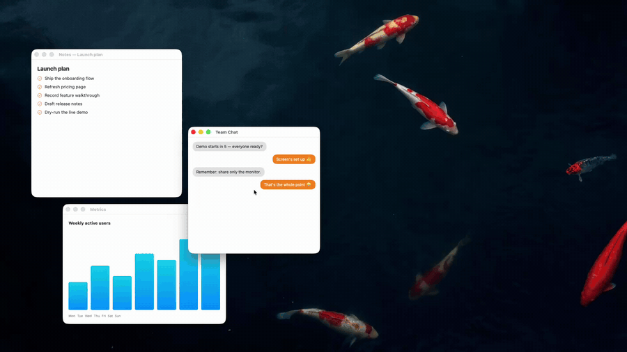
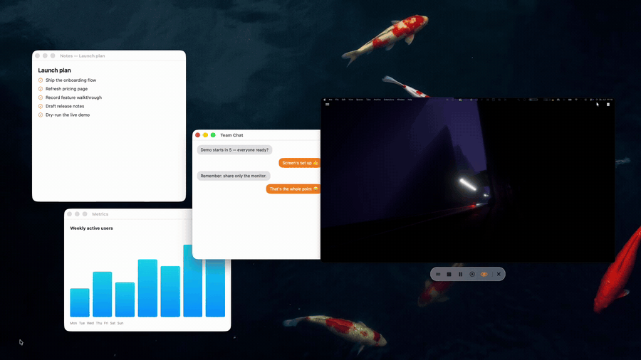

# Outcut Share

  

Share a selected part of your screen in Zoom, Teams, Meet instead of a
full screen or a single window. Two ways:

- **Region sharing** — drag a rectangle over any part of your screen; that
  area becomes a window (or display) your meeting app can share. For when
  a full screen is too much and a single app window is too little.
- **Virtual Monitor** — an additional, empty screen you see and control
  through a preview panel. Only windows you drag onto it are shared; the
  rest of your desktop is never captured.

## Feature showcase

### Region selection

Selecting works like the macOS screenshot overlay: draw a rectangle over
the part of the screen you want to share (the mock call window in the
clip mirrors what viewers see). Modifiers refine the shape:

- **Drag** draws a freeform region.
- **⌃ Ctrl** while dragging snaps to standard sizes (1280×720, 1600×900,
  1920×1080), previewed as labeled outlines.
- **⇧ Shift** while dragging locks the current aspect ratio.
- **Space** before dragging switches to window picking — click a window to
  take its bounds.
- **Space** while dragging freezes the size and moves the selection
  instead.

### Follow mode

Follow mode moves the shared region automatically so it stays on what you
are working on, instead of you re-selecting or dragging it around. It is
enabled per session from the menu bar (*Follow*) or the hotbar's follow
button (the icon toggles it, the label picks the target) and has two
targets — the clip shows Active Window first, then Cursor:

- **Active Window** — the region jumps to the frontmost window whenever
  focus changes, and by default adopts that window's size.
- **Cursor** — the region shifts to keep the pointer inside it; it starts
  moving once the cursor gets within 80 pt of an edge.
- Movement is either **snap** (instant) or **glide** (eased) —
  *Settings → Follow movement*.

### Virtual Monitor

The Virtual Monitor is an extra screen that starts empty; your meeting
app shares that screen. You see it through a preview panel on your real
display and arrange it by dragging windows in and out — nothing appears
on it unless you put it there.

- **Drag a window onto the preview** to move it to the monitor; a live
  ghost shows where it will land.
- **⇧ Shift** during a drag opens a 3 × 3 layout grid — drop into a cell,
  or sweep across several cells to span rows, columns and blocks.
- **Drag a window off the preview** to bring it back to your real screen.
- **Control mode** (cursor button) lets you click through the preview to
  operate apps on the monitor; pushing an edge of the virtual screen
  brings the cursor back.
- **Stopping** returns all windows to your real screen.

*(All clips are recorded by the app itself — `--demo=region|follow|monitor`
produces them on a synthetic stage with fake content, see
[development](docs/development.md).)*

## Install

Download the latest zip from
[Releases](https://github.com/fwin-git/OutcutShare/releases), unzip, move the
app anywhere. Not notarized: right-click → Open once (or
`xattr -d com.apple.quarantine`). Requires macOS 14+.

## Quick start — share a region

1. Menu bar → **Select Region & Share** (⌃⌥⌘S), drag a rectangle — or press
   **Space** and click a window.
2. In your meeting app, share the window named **"Outcut Share (Share
   Region)"** (rename it in Settings).
3. **⌃⌥⌘L** re-shares the last region next time; **⌃⌥⌘X** stops.

Region sharing runs as a **hidden window** — the intended mode: it lists
under "share window", resizes live without interrupting the share, and your
cursor can't wander onto it. If your meeting tool can't capture windows,
switch *Settings → Share as* to **Virtual Display** — the same region
appears as an extra monitor under "share screen" instead (fallback; see
[how it works](docs/how-it-works.md) for the trade-offs).

The first launch guides you through the one required permission
(Screen & System Audio Recording) with live checkmarks.

## Quick start — Virtual Monitor

1. *Settings → Share as →* **Virtual Monitor**, then menu bar → **Start
   Virtual Monitor & Share**.
2. A large preview panel opens — your window into the new screen. **Drag
   any window onto it** to move it there; share the monitor under "share
   screen" in your meeting app.
3. Arrange through the preview: drag windows around (a live ghost follows),
   hold **⇧** for a 3 × 3 layout grid — drop in a cell or sweep across
   cells to span rows, columns and blocks. Drag a window off the panel to
   bring it back to your real screen.
4. The cursor button turns on **control mode**: click through the preview
   to drive folders and browsers on the monitor; push any edge of the
   virtual screen to bring the cursor home.

Everything on the monitor comes back to your screen (and your current
Space) when you stop. Window moving uses the optional Accessibility
permission; a guided row appears when it's needed.

## What else it can do

- **Live move & resize** while sharing a region — viewers see the content
  follow, the share never interrupts. Corners + edges, snapping, aspect
  lock, standard sizes. → [modifiers](docs/resize-modifiers.md)
- **Dimming & border** — everything outside the region dims locally, with a
  configurable border; viewers never see either. → [settings](docs/settings.md)
- **Shared-output preview** — a small floating window with exactly what
  viewers see, no need to keep the meeting app open.
- **Presets & last region** — save regions, re-share with ⌃⌥⌘1–9 or ⌃⌥⌘L;
  while sharing, a compatible preset glides the live region over without
  restarting the share.
- **Follow mode** — the region tracks your active window or cursor
  (snap or glide).
- **Privacy pause** (⌃⌥⌘P) — viewers see a frozen frame or a blurred
  privacy screen — with your own message or image — while you handle
  something private.
- **Viewer privacy filters** — notification banners and windows of chosen
  apps (Mail, Messages, …) are removed from the shared picture while staying
  visible to you. → [settings](docs/settings.md)
- **Cursor emphasis** — halo + click ripples, drawn for viewers only.
- **Viewer zoom** (⌃⌥⌘Z) — the shared picture glides into a 1.5–3× zoom
  toward your cursor and tracks it; your own screen never changes.
- **Recording** (⌃⌥⌘R) — the region straight to .mp4, with system audio
  and optional microphone.
- **Screenshots** — the hotbar's camera button saves the shared picture;
  folder, max size, quality and drop shadow are configurable. Every
  capture (and finished recording) pops a short-lived preview card with
  Finder, Quick Look, delete — and drag-to-trim for recordings, straight
  on the card. → [settings](docs/settings.md)
- **Hotbar** — floating quick actions next to the region or monitor preview
  (stop, pause, record, screenshot, highlights, preview, resize, preset,
  follow); draggable, dismissible, toggleable from menu & Settings.
- **Global hotkeys** — all rebindable to any combo, with duplicate warnings.
  → [hotkeys](docs/hotkeys.md)
- **Raycast extension** — trigger sharing, presets, pause, recording and
  modes from Raycast (or any tool, via `outcutshare://` deep links).
  → [raycast](docs/raycast.md)

## Docs

| Page | Contents |
| --- | --- |
| [Hotkeys](docs/hotkeys.md) | Defaults, recording combos, duplicate handling |
| [Raycast & URL scheme](docs/raycast.md) | Extension setup, every outcutshare:// command |
| [Selection & resize modifiers](docs/resize-modifiers.md) | Space/⇧/⌃ in both overlays, edge handles |
| [How it works & caveats](docs/how-it-works.md) | Hidden window, virtual displays, capture pipeline, limitations |
| [Settings reference](docs/settings.md) | Every option on all pages, incl. the Virtual Monitor |
| [Development](docs/development.md) | Build, debug flags, cutting releases |
